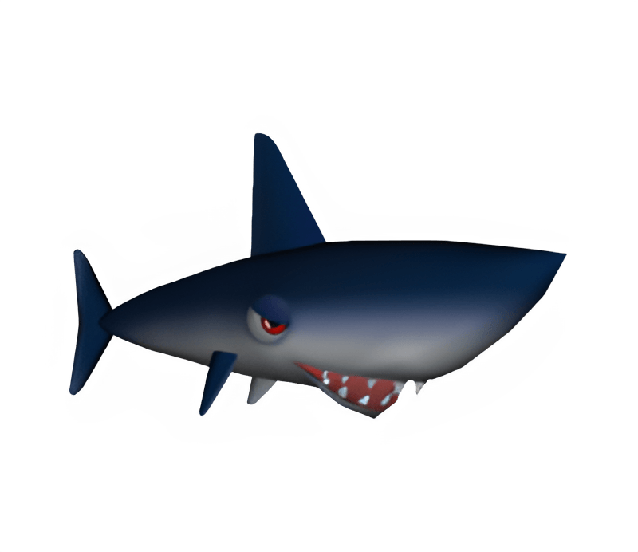

    

<h1 align="center" style="border:none">Hainz</h1>

    
    
    
    
     
    
    
    
    

**Hainz** is a Discord bot for server administration, music, entertainment and more. It's built on top of the [Discord.NET](https://github.com/discord-net/Discord.Net) framework. 

*This project is currently still under development*